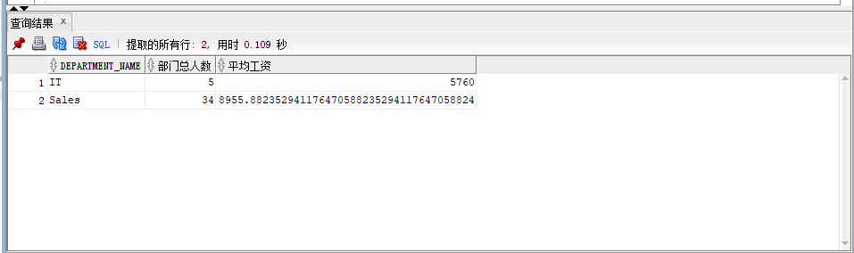
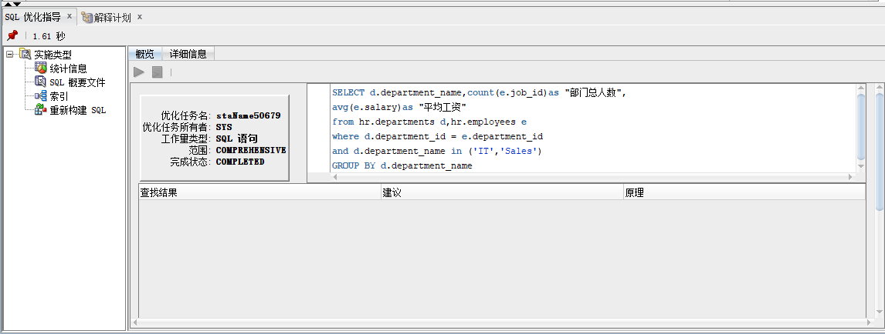
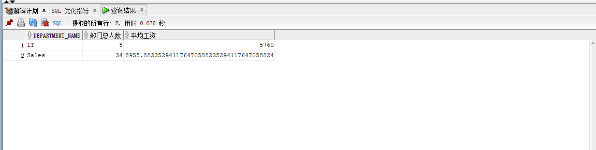
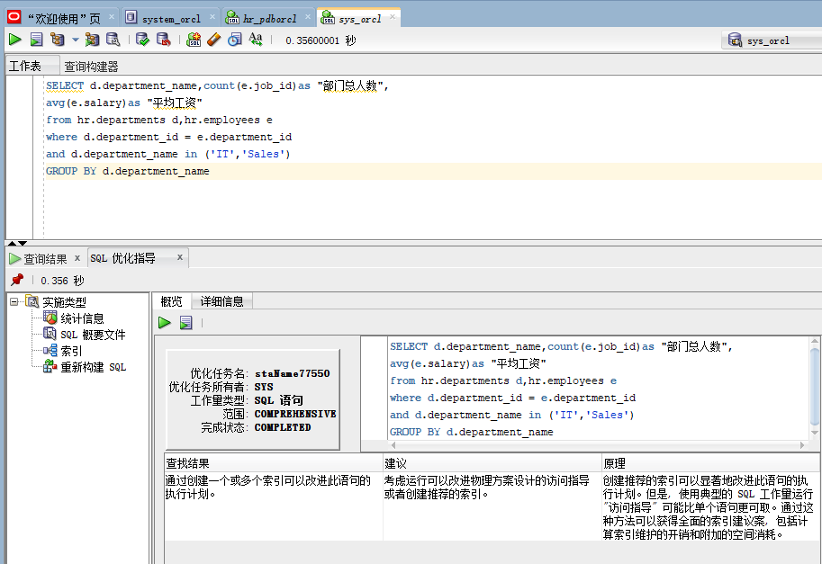
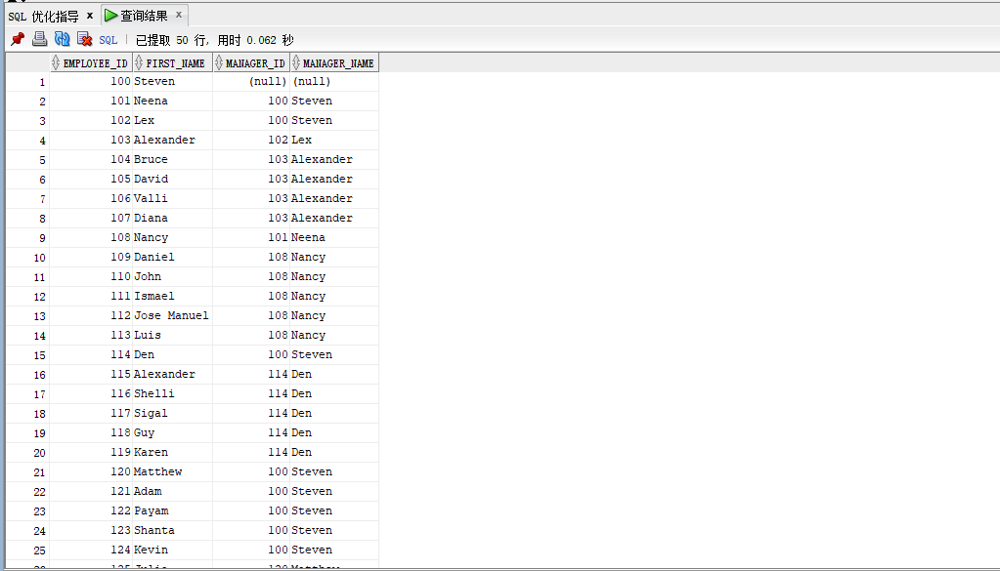
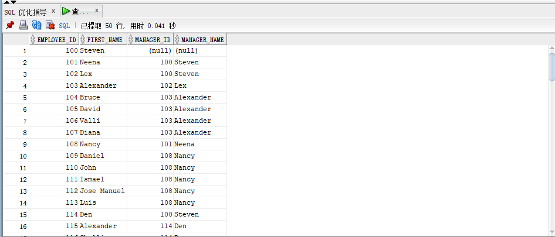
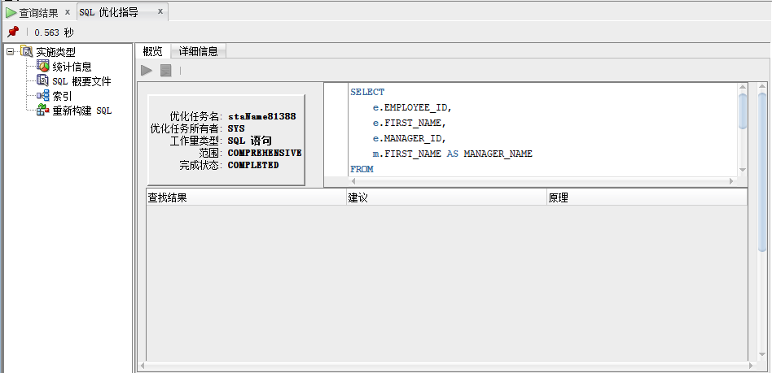

姓名：钟沛兰

学号：201810414106

班级：18软工1班

# 实验一

## 实验目的
分析SQL执行计划，执行SQL语句的优化指导。理解分析SQL语句的执行计划的重要作用。
## 实验要求
* 对Oracle12c中的HR人力资源管理系统中的表进行查询与分析。
* 首先运行和分析教材中的样例：本训练任务目的是查询两个部门('IT'和'Sales')的部门总人数和平均工资，以下两个查询的结果是一样的。但效率不相同。
* 设计自己的查询语句，并作相应的分析，查询语句不能太简单。

## 查询语句
### 语句1：
```sql
    set autotrace on
    SELECT d.department_name,count(e.job_id)as "部门总人数",
    avg(e.salary)as "平均工资"
    from hr.departments d,hr.employees e
    where d.department_id = e.department_id
    and d.department_name in ('IT','Sales')
    GROUP BY d.department_name;
```


### 查询结果：

### 执行优化指导：

可以看出没有优化建议

### 语句2：


```sql
    set autotrace on
    SELECT d.department_name,count(e.job_id)as "部门总人数",
    avg(e.salary)as "平均工资"
    FROM hr.departments d,hr.employees e
    WHERE d.department_id = e.department_id
    GROUP BY d.department_name
    HAVING d.department_name in ('IT','Sales');
```


### 查询结果


### 执行优化指导：



### 结论

* 答：查询1是在索引范围内扫描10行，而查询2是全表进行扫描共107行，查询1所付出的成本小于查询2，故我认为查询1更优。并且在执行优化指导时，查询1没有优化建议，查询2有优化建议。

## 自己设计的查询语句：

### 语句1：
```sql
SELECT
	e.EMPLOYEE_ID,
	e.FIRST_NAME,
	e.MANAGER_ID,
	m.FIRST_NAME AS MANAGER_NAME 
FROM
	HR.employees e,
	HR.employees m 
WHERE
	e.MANAGER_ID = m.EMPLOYEE_ID ( + ) 
ORDER BY
	e.EMPLOYEE_ID;
```


### 查询结果


### 执行优化指导：


### 语句2：

```sql
SELECT
    e.EMPLOYEE_ID,
	e.FIRST_NAME,
	e.MANAGER_ID,
	( SELECT M.FIRST_NAME FROM HR.employees m WHERE m.EMPLOYEE_ID = e.MANAGER_ID ) AS MANAGER_NAME 
FROM
	HR.employees e 
ORDER BY
	e.EMPLOYEE_ID;
```


### 查询结果：

### 执行优化指导：


### 结论
通过使用优化指导，我们得知了语句0的执行速度是优于语句2的。通过观察语句，我们可以看出语句2是使用了子查询，付出的成本时间是要高于语句1的。使得每一次输出之后都要再次查询一次表。